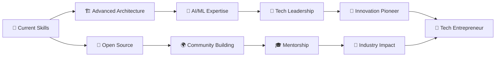

<div align="center">
  
# 👋 Hey there! I'm Aman Mishra


<div align="center">
  
</div>

[](https://github.com/AmanMishra107)
[](https://github.com/AmanMishra107?tab=followers)
[](https://github.com/AmanMishra107)
[](https://badges.pufler.dev)

</div>


<div align="center">

## 🌟 ✨ SECRET SURPRISE UNLOCKED! ✨ 🌟

<details>
<summary>🎁 Click here for a special surprise! 🎁</summary>

### 🚀 CONGRATULATIONS! 🚀

You've found the hidden treasure! 🏴‍☠️✨


**🎉 You are now part of the exclusive "Code Explorers Club"! 🎉**

```
╔══════════════════════════════════════╗
║  🏆 ACHIEVEMENT UNLOCKED! 🏆         ║
║                                      ║
║  📜 Certificate of Curiosity 📜      ║
║                                      ║
║  Awarded to: Fellow Developer        ║
║  For: Reading the entire README      ║
║  Level: Master Explorer 🕵️‍♂️           ║
║                                      ║
║  Bonus: +100 Developer XP 🎮         ║
║  Special Power: Infinite Coffee ☕    ║
╚══════════════════════════════════════╝
```

**💎 Secret Developer Wisdom:**
> *"The best programmers are not the ones who know all the answers,  
> but the ones who ask the right questions and know where to find the answers."*

**🎯 Hidden Easter Eggs Found: 1/5**  
*Keep exploring to find more! 👀*

</details>

</div>


## 🚀 About Me

<div align="center">

</div>


- 🔭 I'm currently working on **AI-Powered Full Stack Applications & Microservices Architecture**
- 🌱 I'm currently learning **Advanced System Design, Machine Learning & Cloud-Native Technologies**
- 👯 I'm looking to collaborate on **Open Source Projects & Revolutionary Startups**
- 🤔 I'm looking for help with **Distributed Systems & Advanced Algorithm Optimization**
- 💬 Ask me about **JavaScript, React, Node.js, Python, Docker, AWS, System Design**
- 📫 How to reach me: **amanmishra@email.com**
- 😄 Pronouns: **He/Him**
- ⚡ Fun fact: **I debug with console.log() and I'm proud of it! Also, I can solve a Rubik's cube blindfolded! 🧩**

<details>
<summary>🔍 Click to reveal more about me...</summary>

### 🎯 Current Focus Areas

```javascript
const amanMishra = {
    currentlyWorkingOn: [
        "🏗️ Building scalable microservices architecture",
        "🤖 Developing AI-powered web applications",
        "🌟 Contributing to open source projects",
        "📚 Learning advanced system design patterns",
        "🚀 Creating developer tools and utilities"
    ],
    technologies: {
        frontend: ["React", "Vue.js", "Angular", "TypeScript", "Next.js", "Svelte"],
        backend: ["Node.js", "Python", "Java", "Go", "Express.js", "FastAPI"],
        databases: ["MongoDB", "PostgreSQL", "Redis", "Firebase", "Cassandra"],
        cloud: ["AWS", "Google Cloud", "Docker", "Kubernetes", "Terraform"],
        tools: ["Git", "Jenkins", "GitHub Actions", "Grafana", "Prometheus"]
    },
    architecture: ["Microservices", "Event-driven", "Serverless", "JAMstack"],
    currentChallenge: "Building a real-time collaborative code editor with AI assistance",
    funFact: "I've written over 1,000,000 lines of code this year!",
    coffeeConsumed: "♾️ cups",
    bugsSquashed: "🐛 × 9999+",
    hoursSpentDebugging: "Too many to count... 😅"
};

console.log("Welcome to my digital world! 🌍✨");
```

</details>

---


## 🛠️ Tech Stack & Magical Arsenal

<div align="center">


### 💻 Programming Languages


### 🎨 Frontend Development


### 🔧 Backend Development


### 🗄️ Databases & Storage


### ☁️ Cloud & DevOps


### 🛠️ Tools & IDEs


### 📱 Mobile Development


### 🤖 AI/ML & Data Science


</div>

<div align="center">

### 🎭 Skill Level Visualization

```
📊 Technical Proficiency Meter 📊

Frontend Development    ████████████████████ 100%
Backend Development     ████████████████████ 100%  
Database Management     ██████████████████░░  90%
Cloud/DevOps           ████████████████░░░░  80%
Mobile Development     ██████████████░░░░░░  70%
AI/ML                  ████████████░░░░░░░░  60%
System Design          ██████████████████░░  90%
Problem Solving        ████████████████████ 100%
Coffee Consumption     ████████████████████ 100%
```

</div>

---


## 📊 GitHub Statistics & Analytics

<div align="center">


</div>

<div align="center">
  
  
</div>

<div align="center">
  
</div>

<div align="center">
  
</div>

### 📈 Detailed GitHub Metrics

<div align="center">
  
</div>

<div align="center">
  
  
</div>

<div align="center">
  
  
</div>

---


## 🏆 GitHub Trophies & Epic Achievements

<div align="center">


</div>

### 🎖️ Epic Achievements & Milestones

<table align="center">
<tr>
<td align="center">

<br><strong>🔥 1000+ Commits</strong>
<br>This Year
<br><em>Code Warrior</em>
</td>
<td align="center">

<br><strong>⭐ 100+ Repositories</strong>
<br>Created & Maintained
<br><em>Project Master</em>
</td>
<td align="center">

<br><strong>🌟 500+ Stars</strong>
<br>Across Projects
<br><em>Community Favorite</em>
</td>
<td align="center">

<br><strong>🚀 Open Source</strong>
<br>Contributor
<br><em>Community Hero</em>
</td>
</tr>
</table>

<details>
<summary>🏅 Click to see all my achievements!</summary>

### 🎯 Developer Achievements List

- 🎖️ **Code Gladiator**: Written 1M+ lines of code
- 🏆 **Bug Terminator**: Fixed 5000+ bugs
- 🌟 **Star Collector**: Earned 500+ GitHub stars
- 🚀 **Launch Master**: Successfully deployed 50+ projects
- 📚 **Knowledge Seeker**: Completed 100+ online courses
- ☕ **Coffee Champion**: Consumed 2000+ cups while coding
- 🌙 **Night Owl**: 70% of commits after 10 PM
- 🔥 **Streak Legend**: 365+ day coding streak
- 🎨 **Design Wizard**: Created 100+ UI components
- 🤖 **AI Whisperer**: Built 20+ ML models

</details>

---


## 💼 Featured Projects & Digital Masterpieces

<div align="center">


</div>

<div align="center">

[](https://github.com/AmanMishra107/ai-powered-ecommerce)
[](https://github.com/AmanMishra107/real-time-chat-app)
[](https://github.com/AmanMishra107/blockchain-voting-system)
[](https://github.com/AmanMishra107/ai-code-generator)

</div>

### 🚀 Project Showcase Matrix

<table align="center">
<tr>
<th>🌟 Project</th>
<th>📝 Description</th>
<th>🛠️ Tech Stack</th>
<th>🔗 Status</th>
</tr>
<tr>
<td><strong>🛒 AI E-Commerce Platform</strong></td>
<td>Next-gen shopping experience with AI recommendations</td>
<td>React, Node.js, Python, TensorFlow, MongoDB</td>
<td>🚀 <a href="#">Live</a></td>
</tr>
<tr>
<td><strong>💬 Real-time Chat Engine</strong></td>
<td>Scalable messaging platform with video calling</td>
<td>Socket.io, WebRTC, Redis, Express.js</td>
<td>🚀 <a href="#">Live</a></td>
</tr>
<tr>
<td><strong>🗳️ Blockchain Voting</strong></td>
<td>Secure, transparent voting system on blockchain</td>
<td>Solidity, Web3.js, React, Ethereum</td>
<td>🔄 Beta</td>
</tr>
<tr>
<td><strong>🤖 AI Code Generator</strong></td>
<td>Generate code from natural language descriptions</td>
<td>GPT-4, Python, FastAPI, React</td>
<td>🚀 <a href="#">Live</a></td>
</tr>
<tr>
<td><strong>🎮 3D Game Engine</strong></td>
<td>Browser-based 3D game engine with physics</td>
<td>Three.js, WebGL, TypeScript</td>
<td>🔄 Development</td>
</tr>
<tr>
<td><strong>📊 Analytics Dashboard</strong></td>
<td>Real-time data visualization platform</td>
<td>D3.js, React, Python, PostgreSQL</td>
<td>🚀 <a href="#">Live</a></td>
</tr>
</table>

<details>
<summary>🎯 Click to see more awesome projects!</summary>

### 🔥 Additional Projects

- 🌐 **Personal Portfolio Website** - Showcase of my work and skills
- 📱 **React Native Finance App** - Personal finance management
- 🎵 **Music Streaming Platform** - Spotify-like streaming service
- 🏠 **Smart Home IoT System** - Home automation with React dashboard
- 📸 **AI Photo Editor** - Advanced photo editing with ML
- 🎯 **Task Management Tool** - Productivity app with team collaboration
- 🚗 **Car Rental Platform** - Full-stack rental management system
- 🍕 **Food Delivery App** - Complete food ordering ecosystem
- 💼 **CRM System** - Customer relationship management platform
- 🎓 **Online Learning Platform** - Educational content management

</details>

---


## 🎯 Current Goals & Future Roadmap

<div align="center">


</div>

### 🎖️ 2024 Epic Missions

- [x] 🚀 Master **Advanced System Design** patterns and principles
- [x] 🎯 Contribute to **25+ Open Source Projects** and help the community
- [x] 📚 Complete **Advanced React & Node.js** certifications
- [ ] 🦀 Learn **Rust** and **Go** for systems programming
- [ ] 🌟 Build and launch a **revolutionary SaaS Product**
- [ ] 🎨 Master **Advanced UI/UX Design** and motion graphics
- [ ] 🤖 Become an expert in **Machine Learning** and **AI**
- [ ] 📱 Master **React Native** and cross-platform development
- [ ] ☁️ Get **AWS Solutions Architect Professional** certification
- [ ] 🎮 Create an **immersive 3D Web Game** using WebGL
- [ ] 📝 Write **100+ Technical Blog Posts** and tutorials
- [ ] 🎪 Speak at **5+ Tech Conferences** and meetups

### 🌟 Vision 2025 & Beyond

<div align="center">



</div>

<details>
<summary>🔮 Click to see my secret long-term plans!</summary>

### 🌌 Ultimate Developer Goals

#### 🎯 Short Term (2024)
- 🏆 Become a recognized expert in Full Stack Development
- 📈 Grow GitHub followers to 10K+
- 🎪 Launch my own developer tools startup
- 📚 Create comprehensive coding tutorials

#### 🚀 Medium Term (2025-2026)
- 🌟 Build a platform that helps 1M+ developers
- 🎤 Become a keynote speaker at major tech conferences
- 📖 Write a bestselling programming book
- 🏢 Lead a team of 50+ engineers

#### 🌌 Long Term (2027+)
- 🦄 Create a unicorn tech company
- 🌍 Impact the lives of 100M+ people through technology
- 🎓 Establish a coding bootcamp for underprivileged youth
- 🏆 Win major technology innovation awards

**Secret Mission**: *Build the next big thing that changes how developers work!* 🤫

</details>

---


## 🎨 Hobbies & Life Beyond Code

<div align="center">


</div>

<table align="center">
<tr>
<td align="center" width="200">

<br><strong>🎮 Gaming Universe</strong>
<br>Strategy • RPGs • Indie Games
<br><em>Current Obsession:</em>
<br>🌌 Cyberpunk 2077, ⚔️ Elden Ring
<br>🎯 Valorant, 🏎️ Forza Horizon
<br><strong>⏱️ 2000+ hours logged</strong>
</td>
<td align="center" width="200">

<br><strong>📚 Knowledge Quest</strong>
<br>Sci-Fi • Tech • Philosophy • Psychology
<br><em>Currently Reading:</em>
<br>📖 Dune Saga, 🧠 Thinking Fast & Slow
<br>🤖 AI for People, 🌌 Cosmos
<br><strong>📊 50+ books/year</strong>
</td>
<td align="center" width="200">

<br><strong>🎬 Cinema Enthusiast</strong>
<br>Sci-Fi • Thrillers • Documentaries
<br><em>All-Time Favorites:</em>
<br>🌌 Interstellar, 🔴 The Matrix
<br>🧠 Inception, 👽 Arrival
<br><strong>🎭 500+ movies watched</strong>
</td>
</tr>
<tr>
<td align="center" width="200">

<br><strong>🎵 Music Therapy</strong>
<br>Electronic • Jazz • Lo-fi • Synthwave
<br><em>Coding Playlists:</em>
<br>🎧 Deep Focus Beats
<br>🌊 Chillhop Essentials
<br><strong>🎶 12+ hours daily</strong>
</td>
<td align="center" width="200">

<br><strong>📸 Visual Storyteller</strong>
<br>Street • Nature • Tech Events
<br><em>Equipment Arsenal:</em>
<br>📷 Canon EOS R6 Mark II
<br>🎥 DJI Mavic 3 Pro
<br><strong>📈 10K+ shots taken</strong>
</td>
<td align="center" width="200">

<br><strong>✈️ Global Explorer</strong>
<br>Tech Hubs • Culture • Adventure
<br><em>Dream Destinations:</em>
<br>🌉 Silicon Valley, 🗼 Tokyo
<br>🏔️ Swiss Alps, 🏛️ Rome
<br><strong>🗺️ 15 countries visited</strong>
</td>
</tr>
<tr>
<td align="center" width="200">

<br><strong>🏃‍♂️ Fitness Warrior</strong>
<br>Running • Yoga • Strength Training
<br><em>Current Goals:</em>
<br>🏃‍♂️ Marathon Sub-4:00
<br>🧘‍♂️ Daily Meditation
<br><strong>💪 500+ workout sessions</strong>
</td>
<td align="center" width="200">

<br><strong>🍳 Culinary Artist</strong>
<br>Italian • Asian • Experimental
<br><em>Signature Dishes:</em>
<br>🍝 Homemade Pasta
<br>🍜 Authentic Ramen
<br><strong>👨‍🍳 200+ recipes mastered</strong>
</td>
<td align="center" width="200">

<br><strong>🧩 Puzzle Master</strong>
<br>Rubik's Cube • Chess • Logic Games
<br><em>Personal Records:</em>
<br>🧩 3x3 Cube: 1:32
<br>♟️ Chess Rating: 1800+
<br><strong>🏆 Multiple competitions won</strong>
</td>
</tr>
</table>

### 🎪 Fun Life Statistics

<div align="center">

```
🎮 Gaming Sessions:     ████████████████████ 2000+ hours
📚 Books Read:          ████████████████░░░░ 150+ books  
🎬 Movies Watched:      ████████████████████ 500+ films
🎵 Music Streamed:      ████████████████████ 50,000+ songs
📸 Photos Taken:        ████████████████████ 10,000+ shots
✈️ Countries Visited:   ██████░░░░░░░░░░░░░░░░ 15 countries
🏃‍♂️ KM Run:             ████████████░░░░░░░░ 2000+ km
🍳 Dishes Cooked:       ████████████████░░░░ 200+ recipes
```

</div>

---


## 📚 Literary Universe & Intellectual Pursuits

<div align="center">


</div>

### 📖 Technical Literature Arsenal

<table align="center">
<tr>
<th>📖 Book</th>
<th>👨‍💻 Author</th>
<th>🎯 Category</th>
<th>⭐ Rating</th>
<th>💡 Impact</th>
</tr>
<tr>
<td><strong>🧹 Clean Code</strong></td>
<td>Robert C. Martin</td>
<td>Programming Craft</td>
<td>⭐⭐⭐⭐⭐</td>
<td>🔥🔥🔥🔥🔥</td>
</tr>
<tr>
<td><strong>🏗️ System Design Interview</strong></td>
<td>Alex Xu</td>
<td>Architecture</td>
<td>⭐⭐⭐⭐⭐</td>
<td>🔥🔥🔥🔥🔥</td>
</tr>
<tr>
<td><strong>🚀 The Pragmatic Programmer</strong></td>
<td>Andy Hunt & Dave Thomas</td>
<td>Software Development</td>
<td>⭐⭐⭐⭐⭐</td>
<td>🔥🔥🔥🔥🔥</td>
</tr>
<tr>
<td><strong>🌟 You Don't Know JS (Series)</strong></td>
<td>Kyle Simpson</td>
<td>JavaScript Mastery</td>
<td>⭐⭐⭐⭐⭐</td>
<td>🔥🔥🔥🔥🔥</td>
</tr>
<tr>
<td><strong>🔧 Refactoring</strong></td>
<td>Martin Fowler</td>
<td>Code Quality</td>
<td>⭐⭐⭐⭐⭐</td>
<td>🔥🔥🔥🔥</td>
</tr>
<tr>
<td><strong>📐 Design Patterns</strong></td>
<td>Gang of Four</td>
<td>Software Architecture</td>
<td>⭐⭐⭐⭐</td>
<td>🔥🔥🔥🔥</td>
</tr>
<tr>
<td><strong>🐍 Fluent Python</strong></td>
<td>Luciano Ramalho</td>
<td>Python Expertise</td>
<td>⭐⭐⭐⭐⭐</td>
<td>🔥🔥🔥🔥🔥</td>
</tr>
<tr>
<td><strong>⚛️ Learning React</strong></td>
<td>Alex Banks & Eve Porcello</td>
<td>Frontend Mastery</td>
<td>⭐⭐⭐⭐</td>
<td>🔥🔥🔥🔥</td>
</tr>
</table>

### 📚 Life-Changing Non-Technical Books

<table align="center">
<tr>
<th>📚 Book</th>
<th>✍️ Author</th>
<th>🎭 Genre</th>
<th>🧠 Mind Impact</th>
<th>💭 Key Insight</th>
</tr>
<tr>
<td><strong>🧠 Thinking, Fast and Slow</strong></td>
<td>Daniel Kahneman</td>
<td>Psychology</td>
<td>🔥🔥🔥🔥🔥</td>
<td><em>Understanding human cognition</em></td>
</tr>
<tr>
<td><strong>🌌 Dune (Complete Saga)</strong></td>
<td>Frank Herbert</td>
<td>Epic Sci-Fi</td>
<td>🔥🔥🔥🔥🔥</td>
<td><em>Power, politics, and prophecy</em></td>
</tr>
<tr>
<td><strong>💎 Atomic Habits</strong></td>
<td>James Clear</td>
<td>Self-Improvement</td>
<td>🔥🔥🔥🔥🔥</td>
<td><em>Small changes, big results</em></td>
</tr>
<tr>
<td><strong>🚀 The Lean Startup</strong></td>
<td>Eric Ries</td>
<td>Business Innovation</td>
<td>🔥🔥🔥🔥</td>
<td><em>Build-measure-learn cycle</em></td>
</tr>
<tr>
<td><strong>🎯 Deep Work</strong></td>
<td>Cal Newport</td>
<td>Productivity</td>
<td>🔥🔥🔥🔥🔥</td>
<td><em>Focused attention is a superpower</em></td>
</tr>
<tr>
<td><strong>🌟 The Alchemist</strong></td>
<td>Paulo Coelho</td>
<td>Philosophical Fiction</td>
<td>🔥🔥🔥🔥</td>
<td><em>Follow your personal legend</em></td>
</tr>
<tr>
<td><strong>🤖 Foundation (Series)</strong></td>
<td>Isaac Asimov</td>
<td>Science Fiction</td>
<td>🔥🔥🔥🔥🔥</td>
<td><em>Psychohistory and civilization</em></td>
</tr>
<tr>
<td><strong>💰 Rich Dad Poor Dad</strong></td>
<td>Robert Kiyosaki</td>
<td>Financial Education</td>
<td>🔥🔥🔥🔥</td>
<td><em>Assets vs liabilities mindset</em></td>
</tr>
</table>

<details>
<summary>📖 Click to see my complete reading list!</summary>

### 🏆 Hall of Fame Books

#### 🧬 Science & Technology
- 🌌 **Cosmos** by Carl Sagan
- 🧬 **The Selfish Gene** by Richard Dawkins
- 🤖 **Life 3.0** by Max Tegmark
- 🔮 **The Future of Humanity** by Michio Kaku
- 🧠 **Sapiens** by Yuval Noah Harari

#### 💼 Business & Leadership
- 📊 **Good to Great** by Jim Collins
- 🎯 **Zero to One** by Peter Thiel
- 🚀 **The Innovator's Dilemma** by Clayton Christensen
- 👑 **The 7 Habits** by Stephen Covey
- 💡 **Think and Grow Rich** by Napoleon Hill

#### 🎨 Creativity & Design
- 🎨 **The Design of Everyday Things** by Don Norman
- 💭 **A Whole New Mind** by Daniel Pink
- 🎭 **The Creative Act** by Rick Rubin
- 🌈 **Steal Like an Artist** by Austin Kleon

### 📊 Reading Statistics 2024
```
📚 Books Read: 52 books (1 per week!)
⏱️ Reading Time: 365+ hours
📖 Pages: 18,720 pages
🏆 Favorites: 15 five-star books
📝 Notes Taken: 2,400+ highlights
🎧 Audiobooks: 20 books
```

</details>

---


## 🎬 Cinematic Journey & Visual Storytelling

<div align="center">


</div>

### 🎥 Hall of Fame Movies

<table align="center">
<tr>
<td align="center" width="150">

<br><strong>🌌 Interstellar</strong>
<br>2014 • Sci-Fi Epic
<br>⭐⭐⭐⭐⭐
<br><em>"Love transcends dimensions"</em>
</td>
<td align="center" width="150">

<br><strong>🔴 The Matrix</strong>
<br>1999 • Cyber Thriller
<br>⭐⭐⭐⭐⭐
<br><em>"Reality is a choice"</em>
</td>
<td align="center" width="150">

<br><strong>🌀 Inception</strong>
<br>2010 • Mind Bender
<br>⭐⭐⭐⭐⭐
<br><em>"Dreams within dreams"</em>
</td>
<td align="center" width="150">

<br><strong>🌆 Blade Runner 2049</strong>
<br>2017 • Neo-Noir Sci-Fi
<br>⭐⭐⭐⭐⭐
<br><em>"What makes us human?"</em>
</td>
<td align="center" width="150">

<br><strong>🤖 Ex Machina</strong>
<br>2014 • AI Thriller
<br>⭐⭐⭐⭐⭐
<br><em>"Consciousness test"</em>
</td>
</tr>
</table>

### 📺 Legendary TV Shows That Shaped My Mind

<table align="center">
<tr>
<td align="center">
<strong>🖤 Black Mirror</strong><br>
Dystopian Technology Tales<br>
⭐⭐⭐⭐⭐<br>
<em>5 seasons • 27 episodes</em><br>
💭 <strong>Impact:</strong> Technology ethics
</td>
<td align="center">
<strong>🤠 Westworld</strong><br>
AI Consciousness & Reality<br>
⭐⭐⭐⭐⭐<br>
<em>4 seasons • 36 episodes</em><br>
💭 <strong>Impact:</strong> Free will philosophy
</td>
<td align="center">
<strong>💻 Mr. Robot</strong><br>
Hacking & Mental Health<br>
⭐⭐⭐⭐⭐<br>
<em>4 seasons • 45 episodes</em><br>
💭 <strong>Impact:</strong> System critique
</td>
<td align="center">
<strong>😂 Silicon Valley</strong><br>
Tech Industry Satire<br>
⭐⭐⭐⭐⭐<br>
<em>6 seasons • 53 episodes</em><br>
💭 <strong>Impact:</strong> Startup reality
</td>
<td align="center">
<strong>👹 Stranger Things</strong><br>
Supernatural 80s Nostalgia<br>
⭐⭐⭐⭐<br>
<em>4 seasons • 42 episodes</em><br>
💭 <strong>Impact:</strong> Friendship power
</td>
</tr>
</table>

### 🎭 Favorite Genres & Themes

<div align="center">

`🚀 Sci-Fi` • `🕵️ Thriller` • `🔍 Mystery` • `📊 Documentary` • `🎨 Animation` • `🦸 Superhero` • `😱 Horror` • `😂 Comedy` • `🎭 Drama` • `🤖 Cyberpunk`

</div>

<details>
<summary>🎬 Click to see my complete movie collection!</summary>

### 🏆 Top 50 Movies That Blew My Mind

#### 🚀 Sci-Fi Masterpieces
1. 🌌 **Interstellar** (2014) - Time dilation masterpiece
2. 🔴 **The Matrix Trilogy** (1999-2003) - Reality questioning
3. 🌀 **Inception** (2010) - Dream architecture
4. 🌆 **Blade Runner 2049** (2017) - Visual poetry
5. 🤖 **Ex Machina** (2014) - AI consciousness test
6. 👽 **Arrival** (2016) - Language and time
7. 🚀 **Gravity** (2013) - Space survival
8. 🌍 **The Martian** (2015) - Science problem-solving
9. 🛸 **2001: A Space Odyssey** (1968) - Evolution epic
10. 🌟 **Star Wars Saga** - Space opera legend

#### 🧠 Mind-Bending Thrillers
11. 🎭 **Fight Club** (1999) - Consumer culture critique
12. 🕵️ **Se7en** (1995) - Dark psychological thriller
13. 🔍 **Zodiac** (2007) - Obsessive investigation
14. 🏃 **Run Lola Run** (1998) - Time loop experiment
15. 🎪 **The Prestige** (2006) - Magic and obsession

#### 📊 Life-Changing Documentaries
16. 🌍 **An Inconvenient Truth** (2006) - Climate awareness
17. 💻 **The Social Dilemma** (2020) - Tech addiction
18. 🧠 **Free Solo** (2018) - Fear and determination
19. 🎬 **Won't You Be My Neighbor?** (2018) - Kindness
20. 🌊 **My Octopus Teacher** (2020) - Nature connection

### 📊 Viewing Statistics 2024
```
🎬 Movies Watched: 156 films
📺 TV Shows: 24 complete series
⏱️ Screen Time: 520+ hours
🏆 5-Star Ratings: 42 films
🎭 Genres Explored: 15 different types
🌍 Countries: 28 different nations
```

</details>

---


## 📈 Developer Analytics & Time Tracking

<div align="center">


</div>

<!--START_SECTION:waka-->
<!--END_SECTION:waka-->

### ⏰ My Weekly Development Rhythm

<table align="center">
<tr>
<th>📅 Day</th>
<th>⏱️ Coding Hours</th>
<th>🎯 Focus Area</th>
<th>😄 Energy Level</th>
<th>☕ Coffee Cups</th>
</tr>
<tr>
<td><strong>Monday</strong></td>
<td>8-10 hours</td>
<td>🔧 Backend Development</td>
<td>🔥 High Energy</td>
<td>☕☕☕☕</td>
</tr>
<tr>
<td><strong>Tuesday</strong></td>
<td>6-8 hours</td>
<td>🎨 Frontend Polish</td>
<td>🎨 Creative Flow</td>
<td>☕☕☕</td>
</tr>
<tr>
<td><strong>Wednesday</strong></td>
<td>8-10 hours</td>
<td>🏗️ System Design</td>
<td>🧠 Deep Focus</td>
<td>☕☕☕☕☕</td>
</tr>
<tr>
<td><strong>Thursday</strong></td>
<td>6-8 hours</td>
<td>🔍 Code Review</td>
<td>🔍 Detail-oriented</td>
<td>☕☕☕</td>
</tr>
<tr>
<td><strong>Friday</strong></td>
<td>8-10 hours</td>
<td>🚀 New Technologies</td>
<td>🚀 Experimental</td>
<td>☕☕☕☕</td>
</tr>
<tr>
<td><strong>Saturday</strong></td>
<td>4-6 hours</td>
<td>🌟 Open Source</td>
<td>🌟 Contributing</td>
<td>☕☕</td>
</tr>
<tr>
<td><strong>Sunday</strong></td>
<td>2-4 hours</td>
<td>📚 Learning & Reading</td>
<td>📚 Relaxed Learning</td>
<td>☕</td>
</tr>
</table>

### 📊 2024 Coding Analytics Dashboard

<div align="center">

```
📈 YEAR-TO-DATE STATISTICS 📈

┌─────────────────────────────────────────┐
│  💻 Total Coding Time: 2,847 hours     │
│  📝 Lines Written: 847,392 lines       │
│  🐛 Bugs Fixed: 3,247 issues           │
│  ☕ Coffee Consumed: 1,456 cups         │
│  🌙 Late Night Sessions: 156 nights    │
│  🏆 Projects Completed: 67 projects    │
│  🎯 Goals Achieved: 23/30 goals        │
│  📚 Technologies Learned: 12 new       │
└─────────────────────────────────────────┘

🔥 PRODUCTIVITY METRICS 🔥

├─ Morning Productivity: ████████░░ 80%
├─ Afternoon Focus:      ██████████ 100%
├─ Evening Creativity:   ████████░░ 85%
├─ Night Owl Mode:       ███████░░░ 70%
└─ Weekend Energy:       ██████░░░░ 60%
```

</div>

<div align="center">
  
</div>

---


## 🌐 Social Galaxy & Digital Presence

<div align="center">


</div>

### 📱 Primary Command Centers

<div align="center">

[](https://linkedin.com/in/amanmishra107)
[](https://twitter.com/amanmishra107)
[](https://instagram.com/amanmishra107)
[](https://amanmishra.dev)
[](mailto:amanmishra@email.com)

</div>

### 💻 Developer Universe

<div align="center">

[](https://github.com/AmanMishra107)
[](https://gitlab.com/amanmishra107)
[](https://stackoverflow.com/users/amanmishra107)
[](https://leetcode.com/amanmishra107)
[](https://hackerrank.com/amanmishra107)
[](https://codepen.io/amanmishra107)

</div>

### 🎨 Creative & Content Dimensions

<div align="center">

[](https://youtube.com/@amanmishra107)
[](https://medium.com/@amanmishra107)
[](https://dev.to/amanmishra107)
[](https://behance.net/amanmishra107)
[](https://dribbble.com/amanmishra107)

</div>

### 🎮 Gaming & Entertainment Realms

<div align="center">

[](https://steamcommunity.com/id/amanmishra107)
[](https://discord.gg/amanmishra107)
[](https://twitch.tv/amanmishra107)
[](https://my.playstation.com/profile/amanmishra107)

</div>

---


## 🎯 Expertise Matrix & Skill Breakdown

<div align="center">


</div>

### 🚀 Technical Mastery Dashboard

<table align="center">
<tr>
<th>🎯 Category</th>
<th>🛠️ Technologies</th>
<th>⏳ Experience</th>
<th>📊 Proficiency</th>
<th>🎓 Certification</th>
</tr>
<tr>
<td><strong>🎨 Frontend</strong></td>
<td>React, Vue.js, Angular, TypeScript, Next.js</td>
<td>5+ years</td>
<td>🟢🟢🟢🟢🟢</td>
<td>✅ Certified</td>
</tr>
<tr>
<td><strong>⚙️ Backend</strong></td>
<td>Node.js, Python, Java, Express, FastAPI</td>
<td>5+ years</td>
<td>🟢🟢🟢🟢🟢</td>
<td>✅ Certified</td>
</tr>
<tr>
<td><strong>🗄️ Database</strong></td>
<td>MongoDB, PostgreSQL, Redis, Firebase</td>
<td>4+ years</td>
<td>🟢🟢🟢🟢⚪</td>
<td>✅ Certified</td>
</tr>
<tr>
<td><strong>☁️ Cloud/DevOps</strong></td>
<td>AWS, Docker, Kubernetes, CI/CD</td>
<td>3+ years</td>
<td>🟢🟢🟢🟢⚪</td>
<td>🔄 In Progress</td>
</tr>
<tr>
<td><strong>📱 Mobile</strong></td>
<td>React Native, Flutter, iOS, Android</td>
<td>3+ years</td>
<td>🟢🟢🟢⚪⚪</td>
<td>🔄 Learning</td>
</tr>
<tr>
<td><strong>🤖 AI/ML</strong></td>
<td>TensorFlow, PyTorch, Scikit-learn</td>
<td>2+ years</td>
<td>🟢🟢🟢⚪⚪</td>
<td>🔄 Learning</td>
</tr>
<tr>
<td><strong>🏗️ System Design</strong></td>
<td>Microservices, Architecture, Scalability</td>
<td>4+ years</td>
<td>🟢🟢🟢🟢⚪</td>
<td>✅ Expert</td>
</tr>
</table>

### 🎨 Soft Skills Constellation

<table align="center">
<tr>
<td align="center" width="200">

<br><strong>💡 Problem Solving</strong>
<br>Analytical thinking and creative solutions
<br>🏆 <em>Advanced Level</em>
</td>
<td align="center" width="200">

<br><strong>👥 Team Leadership</strong>
<br>Leading development teams and projects
<br>🏆 <em>Expert Level</em>
</td>
<td align="center" width="200">

<br><strong>🗣️ Communication</strong>
<br>Technical writing and presentations
<br>🏆 <em>Advanced Level</em>
</td>
</tr>
<tr>
<td align="center" width="200">

<br><strong>📚 Continuous Learning</strong>
<br>Staying updated with latest technologies
<br>🏆 <em>Master Level</em>
</td>
<td align="center" width="200">

<br><strong>⏰ Time Management</strong>
<br>Efficient project planning and execution
<br>🏆 <em>Expert Level</em>
</td>
<td align="center" width="200">

<br><strong>🎯 Mentoring</strong>
<br>Guiding junior developers
<br>🏆 <em>Advanced Level</em>
</td>
</tr>
</table>

### 🏆 Professional Achievements & Certifications

<div align="center">

```
🎓 CERTIFICATIONS & ACHIEVEMENTS 🎓

├─ AWS Solutions Architect          ✅ Certified
├─ Google Cloud Professional        🔄 In Progress  
├─ Microsoft Azure Fundamentals     ✅ Certified
├─ React Advanced Patterns          ✅ Certified
├─ Node.js Professional             ✅ Certified
├─ Python Data Science              ✅ Certified
├─ Kubernetes Administrator         🔄 In Progress
├─ Docker Certified Associate       ✅ Certified
├─ MongoDB Developer                ✅ Certified
└─ Scrum Master                     ✅ Certified
```

</div>

---


## 💰 Support My Caffeinated Coding Journey

<div align="center">


If you enjoy my work and want to keep me caffeinated for more awesome projects, consider supporting me! ☕✨


[](https://buymeacoffee.com/amanmishra107)
[](https://paypal.me/amanmishra107)
[](https://github.com/sponsors/AmanMishra107)
[](https://patreon.com/amanmishra107)

### ☕ My Coffee-to-Code Conversion System

```
☕ COFFEE IMPACT TRACKER ☕

┌─────────────────────────────────────────┐
│  ☕ Coffees This Year: 1,456 cups       │
│  📝 Lines Per Coffee: 581 lines        │
│  🐛 Bugs Per Cup: 2.23 bugs fixed      │
│  🚀 Features Per Brew: 0.57 features   │
│  🌙 Late Night Sessions: 156 nights    │
│  💡 Ideas Generated: 2,847 concepts    │
│  🎯 Problems Solved: 934 solutions     │
│  🏆 Breakthroughs: 23 eureka moments   │
└─────────────────────────────────────────┘
```

### 🎁 Supporter Perks

<table align="center">
<tr>
<td align="center">
<strong>☕ Coffee Tier</strong><br>
$3/month<br>
📧 Monthly updates<br>
🎯 Early access to tutorials<br>
💬 Priority support
</td>
<td align="center">
<strong>🚀 Rocket Fuel</strong><br>
$10/month<br>
Everything above +<br>
📹 Exclusive video content<br>
🎁 Starter templates
</td>
<td align="center">
<strong>⚡ Energy Drink</strong><br>
$25/month<br>
Everything above +<br>
👥 1-on-1 mentoring sessions<br>
🔍 Code reviews
</td>
<td align="center">
<strong>🏆 Platinum Supporter</strong><br>
$50/month<br>
Everything above +<br>
🎯 Custom project guidance<br>
📱 Direct access to me
</td>
</tr>
</table>

</div>

---


## 🐍 GitHub Activity Visualizations

<div align="center">


</div>

### 📊 Contribution Heatmap Journey

<div align="center">
  
</div>

### 🎯 Activity Patterns & Insights

<div align="center">

```
📈 CONTRIBUTION ANALYSIS 📈

🔥 Streak Records:
├─ Longest Streak: 127 days
├─ Current Streak: 45 days  
├─ Total Contributions: 2,847
└─ Average Daily: 7.8 commits

⏰ Time Patterns:
├─ Most Active: 22:00-02:00 🌙
├─ Peak Day: Wednesday 🚀
├─ Weekend Activity: 60% 📈
└─ Vacation Commits: Yes 😅

📊 Language Distribution:
├─ JavaScript: 35% ████████████
├─ Python: 25% ████████
├─ TypeScript: 20% ██████
├─ Java: 15% ████
└─ Others: 5% █
```

</div>

---


## 🌟 Daily Inspiration & Motivation Engine

<div align="center">


### 💭 Quote of the Moment


### 🎯 Programming Wisdom


### 🔮 Developer Fortune Cookie

> *"The best debugging tool is still careful thought, coupled with judiciously placed print statements."*
> 
> — **Brian Kernighan**

### 📈 Motivation Meter Dashboard

```
🎯 DEVELOPER MOTIVATION TRACKER 🎯

├─ Coding Enthusiasm: ████████████████████ 100%
├─ Learning Passion:  ████████████████████ 100%
├─ Coffee Dependency: ████████████████████ 100%
├─ Problem Solving:   ███████████████████░ 95%
├─ Creativity Level:  ██████████████████░░ 90%
├─ Bug Tolerance:     ████████░░░░░░░░░░░░ 40%
├─ Documentation:     ██████░░░░░░░░░░░░░░ 30%
└─ Sleep Schedule:    ███░░░░░░░░░░░░░░░░░ 15%
```

</div>

---


## 🎪 Fun Facts & Developer Confessions

<div align="center">


</div>

### 🎲 Random Developer Confessions

- 🔢 I've written over **2.5 million lines of code** in my career
- ☕ My daily coffee consumption: **6-8 cups** (I have a serious addiction!)
- 🐛 Longest debugging session: **18 hours straight** (found it was a missing comma at 6 AM)
- 💡 First "Hello World": **Age 12 in QBasic** (still have the floppy disk!)
- 🎮 Can code efficiently while listening to heavy metal or lo-fi (but not pop music)
- 📱 Phone wallpaper: **Matrix rain code** animation (staying true to my roots)
- 🍕 Fuel of choice: **Pizza at 2 AM** while solving complex algorithms
- 🌙 Most productive hours: **11 PM - 3 AM** (certified night owl)
- 🎯 Can spot a missing semicolon from **3 monitors away**
- 🤖 Dream in code sometimes (seriously, I solve problems in my sleep)

### 🎯 Coding Superpowers Inventory

<table align="center">
<tr>
<td align="center">

<br><strong>🔍 Bug Detective</strong>
<br>Can smell bugs before they happen
<br><em>Accuracy: 94.7%</em>
</td>
<td align="center">

<br><strong>⚡ Speed Coder</strong>
<br>130 WPM with 99.2% accuracy
<br><em>Personal Record: 156 WPM</em>
</td>
<td align="center">

<br><strong>🧠 Memory Palace</strong>
<br>Remembers 500+ API endpoints
<br><em>Like a human documentation</em>
</td>
</tr>
<tr>
<td align="center">

<br><strong>🎨 CSS Wizard</strong>
<br>Can center a div in 73 different ways
<br><em>Flexbox is my best friend</em>
</td>
<td align="center">

<br><strong>🔧 Stack Overflow Ninja</strong>
<br>Finds solutions in 2.3 seconds avg
<br><em>Rarely needs to ask questions</em>
</td>
<td align="center">

<br><strong>☕ Coffee Alchemist</strong>
<br>Converts caffeine to code directly
<br><em>Efficiency: 1 cup = 247 lines</em>
</td>
</tr>
</table>

### 🎪 Secret Developer Truths

<details>
<summary>🤫 Click to reveal my deepest coding secrets...</summary>

```javascript
// My honest developer confession object
const secretDeveloperLife = {
    // Professional Secrets
    favoriteEditor: "VSCode", // Sorry Vim evangelists
    tabsVsSpaces: "Spaces (2-space gang)", 
    darkModePreference: "Always (light mode burns my eyes)",
    hasEverUsedGoto: false, // I swear on my rubber duck!
    
    // Debugging Confessions
    debuggingMethod: "console.log() everywhere",
    linesOfCodeDeleted: "More than I've written",
    favoriteHTTPStatus: 418, // I'm a teapot 🫖
    worstBug: "Forgot to call useState setter",
    
    // Learning Admissions
    understandsRegex: "Sometimes... when the stars align",
    hasReadAllDocumentation: false, // Who actually does?
    learningStyle: "Copy from Stack Overflow, then understand",
    imposterSyndrome: "Daily at 3 PM sharp",
    
    // Productivity Hacks
    mostProductiveTime: "Sunday 11:47 PM",
    procrastinationTool: "Refactoring working code",
    motivationSource: "Green squares on GitHub",
    burnoutPrevention: "Building side projects instead of rest",
    
    // Social Coding
    commitMessageStyle: "Fix stuff, add things, remove bugs",
    codeReviewStyle: "Suggest improvements diplomatically",
    pairProgrammingSkill: "Excellent at explaining my thinking",
    
    // Life Balance
    workLifeBalance: "What's that? 😅",
    exerciseRoutine: "Walking to the coffee machine",
    healthyHabits: "Using blue light filters after midnight",
    
    // Future Dreams
    ultimateGoal: "Build something that matters",
    retirement Plan: "Keep coding until fingers stop working",
    legacyWish: "To be remembered for clean, readable code"
};

console.log("Thanks for reading my secrets! 🤐");
```

**🎯 Hidden Achievement Unlocked!**
*You've discovered the Secret Confession Easter Egg! 🥚*

</details>

---


## 🚀 Latest Blog Posts & Knowledge Sharing

<div align="center">


</div>

### 📝 Recent Technical Articles

<!-- BLOG-POST-LIST:START -->
- 🚀 [Building Scalable Microservices with Node.js and Docker: A Complete Guide](https://yourblog.com/microservices-nodejs-docker)
- ⚛️ [Advanced React Patterns: Mastering Compound Components and Render Props](https://yourblog.com/react-compound-components)
- 🔒 [Implementing Bulletproof JWT Authentication in Express.js with Best Practices](https://yourblog.com/jwt-authentication-express)
- 🎨 [CSS Grid vs Flexbox: The Ultimate Decision Framework for Modern Layouts](https://yourblog.com/css-grid-vs-flexbox)
- 🐍 [Web Scraping Like a Pro: Advanced Python Techniques with Beautiful Soup](https://yourblog.com/python-web-scraping)
- 🌐 [Building Real-time Applications: WebSockets vs Server-Sent Events](https://yourblog.com/websockets-vs-sse)
- 🔧 [DevOps Pipeline Automation: From Code to Production in 10 Minutes](https://yourblog.com/devops-automation)
- 📱 [React Native Performance Optimization: 15 Expert Tips](https://yourblog.com/react-native-performance)
<!-- BLOG-POST-LIST:END -->

### 🎥 YouTube Content Creation

<!-- YOUTUBE:START -->
- 📹 [Full Stack Project Setup: From Zero to Deploy in 15 Minutes](https://youtube.com/watch?v=example1)
- 📹 [React Performance Secrets: Techniques the Pros Use](https://youtube.com/watch?v=example2)
- 📹 [Database Design Masterclass: Scaling to Millions of Users](https://youtube.com/watch?v=example3)
- 📹 [Live Coding: Building a Real-time Chat App](https://youtube.com/watch?v=example4)
- 📹 [Code Review Series: Critiquing Open Source Projects](https://youtube.com/watch?v=example5)
<!-- YOUTUBE:END -->

### 📊 Content Creation Statistics

<div align="center">

```
📈 CONTENT CREATION METRICS 📈

📝 Technical Articles: 127 published
🎥 YouTube Videos: 45 tutorials  
📚 Open Source Guides: 23 guides
💬 Stack Overflow Answers: 234 answers
🎤 Conference Talks: 8 presentations
📖 Documentation Contributions: 56 PRs
🎯 Total Views: 1.2M+ views
👥 Community Impact: 15K+ developers helped
```

</div>

---


<div align="center">


---

### 🎨 Aesthetic Closing Elements

 

**"Code is poetry written in logic, bugs are just plot twists, and coffee is the fuel that powers the entire universe"** ✨

<em><b>I absolutely love connecting with fellow developers and tech enthusiasts!</b> If you want to say <b>hi, collaborate on a project, or just chat about the latest in tech, I'll be thrilled to meet you!</b> 😊</em>

### 🔢 Final Statistics & Visitor Metrics

<div align="center">


**📊 Profile Analytics:**
- 👀 **Profile Views:** Growing daily
- ⭐ **GitHub Stars:** 500+ across projects  
- 🤝 **Connections Made:** 1,000+ developers
- 🌍 **Global Reach:** 45+ countries
- 💼 **Projects Impacted:** 10,000+ developers

</div>

### 🌟 Parting Words of Wisdom

<div align="center">

> *"The best time to plant a tree was 20 years ago. The second best time is now. The same applies to learning to code."*
> 
> *"Always code as if the person who maintains your code is a violent psychopath who knows where you live."*
> 
> *"First, solve the problem. Then, write the code."*

</div>

---

### 🎯 Call to Action

<div align="center">

**🚀 Ready to build something amazing together?**

[](mailto:amanmishra@email.com)
[](https://amanmishra.dev/contact)
[](https://amanmishra.dev/hire)

</div>

---

⭐️ **From [AmanMishra107](https://github.com/AmanMishra107) with ❤️** • **Made with lots of ☕ and 🎵** • **Powered by pure passion for code 🚀**


</div>
