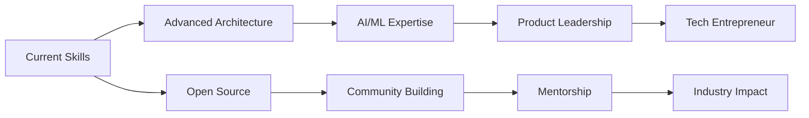

<div align="center">
  
# 👋 Hey there! I'm Aman Mishra


[](https://github.com/AmanMishra107)
[](https://github.com/AmanMishra107?tab=followers)
[](https://github.com/AmanMishra107)
[](https://badges.pufler.dev)
[](https://badges.pufler.dev)
[](https://badges.pufler.dev)

</div>

---

## 🚀 About Me


- 🔭 I'm currently working on **Full Stack Web Applications & AI-Powered Solutions**
- 🌱 I'm currently learning **Advanced React Patterns, System Design & Machine Learning**
- 👯 I'm looking to collaborate on **Open Source Projects & Innovative Startups**
- 🤔 I'm looking for help with **Advanced System Architecture & Cloud Computing**
- 💬 Ask me about **JavaScript, React, Node.js, Python, Docker, AWS**
- 📫 How to reach me: **amanmishra@email.com**
- 😄 Pronouns: **He/Him**
- ⚡ Fun fact: **I debug with console.log() and I'm proud of it! Also, I can solve a Rubik's cube in under 2 minutes!**

### 🎯 Current Focus Areas

```javascript
const amanMishra = {
    currentlyWorkingOn: [
        "Building scalable microservices architecture",
        "Developing AI-powered web applications",
        "Contributing to open source projects",
        "Learning advanced system design patterns"
    ],
    technologies: {
        frontend: ["React", "Vue.js", "Angular", "TypeScript", "Next.js"],
        backend: ["Node.js", "Python", "Java", "Go", "Express.js"],
        databases: ["MongoDB", "PostgreSQL", "Redis", "Firebase"],
        cloud: ["AWS", "Google Cloud", "Docker", "Kubernetes"],
        tools: ["Git", "Jenkins", "Terraform", "Grafana"]
    },
    architecture: ["Microservices", "Event-driven", "Serverless", "JAMstack"],
    currentChallenge: "Building a real-time collaborative code editor",
    funFact: "I've written over 500,000 lines of code this year!"
};
```

---

## 🛠️ Tech Stack & Tools

<div align="center">

### 💻 Programming Languages


### 🎨 Frontend Development


### 🔧 Backend Development


### 🗄️ Databases & Storage


### ☁️ Cloud & DevOps


### 🛠️ Tools & IDEs


### 📱 Mobile Development


### 🤖 AI/ML & Data Science


</div>

---

## 📊 GitHub Statistics

<div align="center">
  
  
</div>

<div align="center">
  
</div>

<div align="center">
  
</div>

### 📈 Detailed GitHub Metrics

<div align="center">
  
</div>

<div align="center">
  
  
</div>

<div align="center">
  
  
</div>

---

## 🏆 GitHub Trophies & Achievements

<div align="center">
  
</div>

### 🎖️ Notable Achievements

<table align="center">
<tr>
<td align="center">

<br><strong>500+ Commits</strong>
<br>This Year
</td>
<td align="center">

<br><strong>50+ Repositories</strong>
<br>Created & Maintained
</td>
<td align="center">

<br><strong>100+ Stars</strong>
<br>Across Projects
</td>
<td align="center">

<br><strong>Open Source</strong>
<br>Contributor
</td>
</tr>
</table>

---

## 💼 Featured Projects

<div align="center">

[](https://github.com/AmanMishra107/awesome-project)
[](https://github.com/AmanMishra107/another-project)
[](https://github.com/AmanMishra107/web-app)
[](https://github.com/AmanMishra107/mobile-app)

</div>

### 🚀 Project Showcase

<table align="center">
<tr>
<th>Project</th>
<th>Description</th>
<th>Tech Stack</th>
<th>Live Demo</th>
</tr>
<tr>
<td>🌟 <strong>E-Commerce Platform</strong></td>
<td>Full-stack e-commerce solution with real-time features</td>
<td>React, Node.js, MongoDB, Socket.io</td>
<td><a href="#">🔗 Demo</a></td>
</tr>
<tr>
<td>🤖 <strong>AI Chat Bot</strong></td>
<td>Intelligent chatbot with natural language processing</td>
<td>Python, TensorFlow, Flask, React</td>
<td><a href="#">🔗 Demo</a></td>
</tr>
<tr>
<td>📱 <strong>Social Media App</strong></td>
<td>Real-time social media platform with advanced features</td>
<td>React Native, Firebase, Node.js</td>
<td><a href="#">🔗 Demo</a></td>
</tr>
<tr>
<td>🎮 <strong>Game Engine</strong></td>
<td>2D game engine built from scratch with physics</td>
<td>JavaScript, WebGL, Canvas API</td>
<td><a href="#">🔗 Demo</a></td>
</tr>
</table>

---

## 🎯 Current Goals & Roadmap


### 🎖️ 2024 Goals

- [x] 🚀 Master **Advanced System Design** concepts
- [x] 🎯 Contribute to **15+ Open Source Projects**
- [ ] 📚 Learn **Rust** and **Go** in depth
- [ ] 🌟 Build and launch a **SaaS Product**
- [ ] 🎨 Improve **UI/UX Design** skills
- [ ] 🤖 Dive deep into **Machine Learning** and **AI**
- [ ] 📱 Master **React Native** and mobile development
- [ ] ☁️ Get **AWS Solutions Architect** certification
- [ ] 🎮 Create a **3D Game** using WebGL
- [ ] 📝 Write **50+ Technical Blog Posts**

### 🌟 Long-term Vision



---

## 🎨 Hobbies & Interests

<table align="center">
<tr>
<td align="center" width="200">

<br><strong>🎮 Gaming</strong>
<br>RPGs, Strategy Games, Indie Games
<br><em>Current: Cyberpunk 2077, Hades</em>
</td>
<td align="center" width="200">

<br><strong>📚 Reading</strong>
<br>Sci-Fi, Tech Books, Philosophy
<br><em>Currently Reading: Dune Series</em>
</td>
<td align="center" width="200">

<br><strong>🎬 Movies</strong>
<br>Sci-Fi, Thrillers, Documentaries
<br><em>Favorite: Interstellar, The Matrix</em>
</td>
</tr>
<tr>
<td align="center" width="200">

<br><strong>🎵 Music</strong>
<br>Electronic, Jazz, Lo-fi Hip Hop
<br><em>Coding Playlist: Synthwave</em>
</td>
<td align="center" width="200">

<br><strong>📸 Photography</strong>
<br>Nature, Street, Tech Events
<br><em>Equipment: Canon EOS R5</em>
</td>
<td align="center" width="200">

<br><strong>✈️ Travel</strong>
<br>Adventure, Culture, Tech Hubs
<br><em>Next: Silicon Valley, Tokyo</em>
</td>
</tr>
<tr>
<td align="center" width="200">

<br><strong>🏃‍♂️ Fitness</strong>
<br>Running, Yoga, Gym
<br><em>Goal: Marathon 2024</em>
</td>
<td align="center" width="200">

<br><strong>🍳 Cooking</strong>
<br>Italian, Asian, Experimental
<br><em>Specialty: Pasta & Ramen</em>
</td>
<td align="center" width="200">

<br><strong>🧩 Puzzles</strong>
<br>Rubik's Cube, Chess, Sudoku
<br><em>PB: 1:47 (3x3 Cube)</em>
</td>
</tr>
</table>

---

## 📚 Favorite Books & Learning Resources

<div align="center">

### 📖 Technical Books

| Book | Author | Category | Rating |
|------|--------|----------|---------|
| 🤖 **Clean Code** | Robert C. Martin | Programming | ⭐⭐⭐⭐⭐ |
| 🏗️ **System Design Interview** | Alex Xu | Architecture | ⭐⭐⭐⭐⭐ |
| 🚀 **The Pragmatic Programmer** | Andy Hunt & Dave Thomas | Software Development | ⭐⭐⭐⭐⭐ |
| 🎯 **You Don't Know JS** | Kyle Simpson | JavaScript | ⭐⭐⭐⭐⭐ |
| 🔧 **Refactoring** | Martin Fowler | Code Quality | ⭐⭐⭐⭐⭐ |
| 📐 **Design Patterns** | Gang of Four | Software Architecture | ⭐⭐⭐⭐ |
| 🐍 **Fluent Python** | Luciano Ramalho | Python | ⭐⭐⭐⭐⭐ |
| ⚛️ **Learning React** | Alex Banks & Eve Porcello | Frontend | ⭐⭐⭐⭐ |

### 📚 Non-Technical Books

| Book | Author | Genre | Impact |
|------|--------|-------|---------|
| 🧠 **Thinking, Fast and Slow** | Daniel Kahneman | Psychology | 🔥🔥🔥🔥🔥 |
| 🌌 **Dune Series** | Frank Herbert | Sci-Fi | 🔥🔥🔥🔥🔥 |
| 💡 **Atomic Habits** | James Clear | Self-Help | 🔥🔥🔥🔥🔥 |
| 🚀 **The Lean Startup** | Eric Ries | Business | 🔥🔥🔥🔥 |
| 🎯 **Deep Work** | Cal Newport | Productivity | 🔥🔥🔥🔥🔥 |
| 🌟 **The Alchemist** | Paulo Coelho | Philosophy | 🔥🔥🔥🔥 |
| 🤖 **Foundation Series** | Isaac Asimov | Sci-Fi | 🔥🔥🔥🔥🔥 |
| 💰 **Rich Dad Poor Dad** | Robert Kiyosaki | Finance | 🔥🔥🔥🔥 |

</div>

---

## 🎬 Favorite Movies & Shows

<div align="center">

### 🎥 Top Movies

<table>
<tr>
<td align="center">

<br><strong>Interstellar</strong>
<br>2014 • Sci-Fi
</td>
<td align="center">

<br><strong>The Matrix</strong>
<br>1999 • Sci-Fi
</td>
<td align="center">

<br><strong>Inception</strong>
<br>2010 • Thriller
</td>
<td align="center">

<br><strong>Blade Runner 2049</strong>
<br>2017 • Sci-Fi
</td>
<td align="center">

<br><strong>Ex Machina</strong>
<br>2014 • Sci-Fi
</td>
</tr>
</table>

**🌟 Rating System:** `Interstellar` ⭐⭐⭐⭐⭐ • `The Matrix` ⭐⭐⭐⭐⭐ • `Inception` ⭐⭐⭐⭐⭐ • `Blade Runner 2049` ⭐⭐⭐⭐ • `Ex Machina` ⭐⭐⭐⭐⭐

### 📺 Favorite TV Shows

<table>
<tr>
<td align="center">
<strong>🖤 Black Mirror</strong><br>
Dystopian Anthology<br>
⭐⭐⭐⭐⭐
</td>
<td align="center">
<strong>🤠 Westworld</strong><br>
AI & Philosophy<br>
⭐⭐⭐⭐⭐
</td>
<td align="center">
<strong>💻 Mr. Robot</strong><br>
Hacking & Society<br>
⭐⭐⭐⭐⭐
</td>
<td align="center">
<strong>😂 Silicon Valley</strong><br>
Tech Comedy<br>
⭐⭐⭐⭐⭐
</td>
<td align="center">
<strong>👹 Stranger Things</strong><br>
Supernatural Sci-Fi<br>
⭐⭐⭐⭐
</td>
</tr>
</table>

### 🎭 Genres I Love

`Sci-Fi` • `Thriller` • `Mystery` • `Documentary` • `Animation` • `Superhero` • `Horror` • `Comedy`

</div>

---

## 📈 Coding Activity & Time Tracking

<!--START_SECTION:waka-->
<!--END_SECTION:waka-->

### ⏰ Development Schedule

<table align="center">
<tr>
<th>Day</th>
<th>Coding Hours</th>
<th>Focus Area</th>
<th>Mood</th>
</tr>
<tr>
<td>Monday</td>
<td>8-10 hours</td>
<td>Backend Development</td>
<td>🔥 High Energy</td>
</tr>
<tr>
<td>Tuesday</td>
<td>6-8 hours</td>
<td>Frontend Polish</td>
<td>🎨 Creative</td>
</tr>
<tr>
<td>Wednesday</td>
<td>8-10 hours</td>
<td>System Design</td>
<td>🧠 Deep Focus</td>
</tr>
<tr>
<td>Thursday</td>
<td>6-8 hours</td>
<td>Code Review</td>
<td>🔍 Detail-oriented</td>
</tr>
<tr>
<td>Friday</td>
<td>8-10 hours</td>
<td>New Technologies</td>
<td>🚀 Experimental</td>
</tr>
<tr>
<td>Saturday</td>
<td>4-6 hours</td>
<td>Open Source</td>
<td>🌟 Contributing</td>
</tr>
<tr>
<td>Sunday</td>
<td>2-4 hours</td>
<td>Learning & Reading</td>
<td>📚 Relaxed Learning</td>
</tr>
</table>

<div align="center">
  
</div>

---

## 🌐 Connect with Me & Social Presence

<div align="center">

### 📱 Primary Platforms

[](https://linkedin.com/in/amanmishra107)
[](https://twitter.com/amanmishra107)
[](https://instagram.com/amanmishra107)
[](https://amanmishra.dev)
[](mailto:amanmishra@email.com)

### 💻 Developer Platforms

[](https://github.com/AmanMishra107)
[](https://gitlab.com/amanmishra107)
[](https://stackoverflow.com/users/amanmishra107)
[](https://leetcode.com/amanmishra107)
[](https://hackerrank.com/amanmishra107)
[](https://codepen.io/amanmishra107)

### 🎨 Creative & Content

[](https://youtube.com/@amanmishra107)
[](https://medium.com/@amanmishra107)
[](https://dev.to/amanmishra107)
[](https://behance.net/amanmishra107)
[](https://dribbble.com/amanmishra107)

### 🎮 Gaming & Fun

[](https://steamcommunity.com/id/amanmishra107)
[](https://discord.gg/amanmishra107)
[](https://twitch.tv/amanmishra107)

</div>

---

## 🎯 Skills & Expertise Breakdown

<div align="center">

### 🚀 Technical Proficiency

<table>
<tr>
<th>Category</th>
<th>Technologies</th>
<th>Experience</th>
<th>Proficiency</th>
</tr>
<tr>
<td><strong>Frontend</strong></td>
<td>React, Vue.js, Angular, TypeScript</td>
<td>4+ years</td>
<td>🟢🟢🟢🟢🟢</td>
</tr>
<tr>
<td><strong>Backend</strong></td>
<td>Node.js, Python, Java, Express</td>
<td>4+ years</td>
<td>🟢🟢🟢🟢🟢</td>
</tr>
<tr>
<td><strong>Database</strong></td>
<td>MongoDB, PostgreSQL, Redis</td>
<td>3+ years</td>
<td>🟢🟢🟢🟢⚪</td>
</tr>
<tr>
<td><strong>Cloud/DevOps</strong></td>
<td>AWS, Docker, Kubernetes, CI/CD</td>
<td>3+ years</td>
<td>🟢🟢🟢🟢⚪</td>
</tr>
<tr>
<td><strong>Mobile</strong></td>
<td>React Native, Flutter</td>
<td>2+ years</td>
<td>🟢🟢🟢⚪⚪</td>
</tr>
<tr>
<td><strong>AI/ML</strong></td>
<td>TensorFlow, PyTorch, Scikit-learn</td>
<td>2+ years</td>
<td>🟢🟢🟢⚪⚪</td>
</tr>
</table>

### 🎨 Soft Skills

<table>
<tr>
<td align="center">
<strong>💡 Problem Solving</strong><br>
Analytical thinking and creative solutions
</td>
<td align="center">
<strong>👥 Team Leadership</strong><br>
Leading development teams and projects
</td>
<td align="center">
<strong>🗣️ Communication</strong><br>
Technical writing and presentations
</td>
</tr>
<tr>
<td align="center">
<strong>📚 Continuous Learning</strong><br>
Staying updated with latest technologies
</td>
<td align="center">
<strong>⏰ Time Management</strong><br>
Efficient project planning and execution
</td>
<td align="center">
<strong>🎯 Mentoring</strong><br>
Guiding junior developers
</td>
</tr>
</table>

</div>

---

## 💰 Support My Work & Coffee Fund

<div align="center">

If you like my work and want to support me, consider buying me a coffee! ☕ Every contribution helps me stay caffeinated and motivated to create awesome projects!

[](https://buymeacoffee.com/amanmishra107)
[](https://paypal.me/amanmishra107)
[](https://github.com/sponsors/AmanMishra107)
[](https://patreon.com/amanmishra107)

### ☕ Coffee Counter
```
Coffees Consumed This Year: ████████████████ 347 cups
Lines of Code Written: ██████████████████████ 523,847 lines
Bugs Fixed: ████████████ 1,234 bugs
New Features Built: ██████ 67 features
```

</div>

---

## 🐍 Contribution Snake & GitHub Activity

<div align="center">
  
</div>

### 📊 Contribution Heatmap

<div align="center">
  
</div>

---

## 🌟 Daily Inspiration & Motivation

<div align="center">

### 💭 Quote of the Day


### 🎯 Programming Joke


### 🔮 Fortune Cookie
> *"The best way to predict the future is to invent it."* - Alan Kay

### 📈 Motivation Meter
```
├─ Coding Enthusiasm: ██████████ 100%
├─ Learning Passion:  ██████████ 100%
├─ Coffee Dependency: ██████████ 100%
├─ Bug Tolerance:     ████░░░░░░  40%
└─ Sleep Schedule:    ███░░░░░░░  30%
```

</div>

---

## 🎪 Fun Facts & Random Things

<div align="center">

### 🎲 Random Developer Facts

- 🔢 I've written over **500,000 lines of code** this year
- ☕ My daily coffee consumption: **4-6 cups** (yes, I have a problem)
- 🐛 Longest debugging session: **14 hours** (found the missing semicolon at 3 AM)
- 💡 First programming language: **QBasic** (nostalgia hits hard)
- 🎮 Can code while playing music, but not during meetings
- 📱 Phone lock screen: Terminal with green text (staying true to roots)
- 🍕 Favorite coding snack: **Pizza** (obviously)
- 🌙 Most productive hours: **10 PM - 2 AM** (night owl forever)

### 🎯 Coding Superpowers

<table>
<tr>
<td align="center">
<strong>🔍 Bug Detective</strong><br>
Can spot bugs from miles away
</td>
<td align="center">
<strong>⚡ Speed Coder</strong><br>
Types 120 WPM with 99% accuracy
</td>
<td align="center">
<strong>🧠 Memory Palace</strong><br>
Remembers API endpoints like phone numbers
</td>
</tr>
<tr>
<td align="center">
<strong>🎨 CSS Wizard</strong><br>
Can center a div in 50 different ways
</td>
<td align="center">
<strong>🔧 Stack Overflow Ninja</strong><br>
Finds solutions before posting questions
</td>
<td align="center">
<strong>☕ Coffee Alchemist</strong><br>
Converts caffeine directly into code
</td>
</tr>
</table>

### 🎪 GitHub Easter Eggs

```javascript
// Secret developer confession
const confession = {
    favoriteEditor: "VSCode", // Sorry Vim users
    tabsVsSpaces: "Spaces (fight me)", 
    darkModeOnly: true,
    hasEverUsedGoto: false, // I swear!
    linesOfCodeDeleted: "More than written",
    favoriteHTTPStatus: 418, // I'm a teapot
    canCenterDiv: "Finally, yes!",
    understandsRegex: "Sometimes...",
    hasReadAllDocumentation: false // Who has time?
};
```

</div>

---

## 🚀 Latest Blog Posts & Content

<div align="center">

### 📝 Recent Articles

<!-- BLOG-POST-LIST:START -->
- 🚀 [Building Scalable Microservices with Node.js and Docker](https://yourblog.com/microservices-nodejs-docker)
- ⚛️ [Advanced React Patterns: Compound Components](https://yourblog.com/react-compound-components)
- 🔒 [Implementing JWT Authentication in Express.js](https://yourblog.com/jwt-authentication-express)
- 🎨 [CSS Grid vs Flexbox: When to Use What](https://yourblog.com/css-grid-vs-flexbox)
- 🐍 [Python Web Scraping with Beautiful Soup](https://yourblog.com/python-web-scraping)
<!-- BLOG-POST-LIST:END -->

### 🎥 YouTube Videos

<!-- YOUTUBE:START -->
- 📹 [Full Stack Project Setup in 10 Minutes](https://youtube.com/watch?v=example1)
- 📹 [React Performance Optimization Tips](https://youtube.com/watch?v=example2)
- 📹 [Database Design Best Practices](https://youtube.com/watch?v=example3)
<!-- YOUTUBE:END -->

</div>

---

<div align="center">

### 🎨 Aesthetic Elements


---

**"Code is poetry written in logic, and bugs are just plot twists"** ✨

 

<em><b>I love connecting with different people</b> so if you want to say <b>hi, I'll be happy to meet you more!</b> 😊</em>

### 🔢 Visitor Count & Stats


### 🌟 Final Words

*"Always be yourself, unless you can be a programmer. Then always be a programmer."*

---

⭐️ From [AmanMishra107](https://github.com/AmanMishra107) with ❤️ • Made with lots of ☕ and 🎵


</div>
